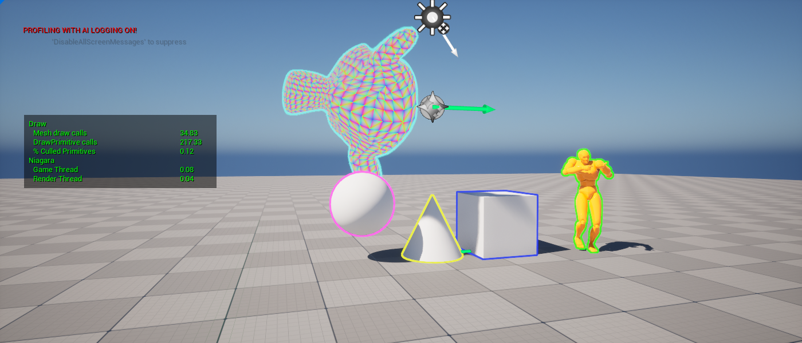

# StatsVisualizer
Unreal Engine plugin for displaying custom stats. 
* Create custom stat groups.
* Combine stats to create custom stats.
* Simple UI to display stats.

**NOTE:** This is not a replacement for built-in stats display :)

# Installation
Clone `git clone git@github.com:amuTBKT/StatsVisualizer.git` or unzip the plugin under Project/Plugins directory

# Settings
Available presets and drawing layout can be configured from **ProjectSettings->Plugins->StatsVisualizer** page.

# Usage
* `stat presets` to toggle stat rendering. This internally runs `stat` command to toggle stat groups.
* `stats.EnablePresets PresetA PresetB` to add presets to active list.
* `stats.SetPresets PresetA PresetB` to set active presets.
* `stats.DisablePresets PresetA` to remove presets from active list.
* `-statpresets=PresetA,PresetB` commandline argument to enable presets by default.

PresetA and PresetB are names for the presets defined in plugin settings.

# Stat Expressions
The flexibility of the plugin comes from combining stats using custom expressions. 
Built-in expressions include:
* `UCustomStatExpressionConstant` to define constant value.
* `UCustomStatExpressionReadStat` to read stat defined in code.
* Add, Subtract, Multiply and Divide operations.

Custom expressions can be defined by inheriting from `UCustomStatExpression`

The example above shows a custom stat "%CulledPrimitives" defined as  
`%CulledPrimitives = (CulledPrimitives + OccludedPrimitives) / ProcessedPrimitives`

# Known Issues / Limitations
* The plugin relies on toggling stat groups internally, so the system can break if user enables stat groups using `stat STATGROUP_NAME` commands. 
  It is recommended not to use `stat` command once the stat presets are active. 
